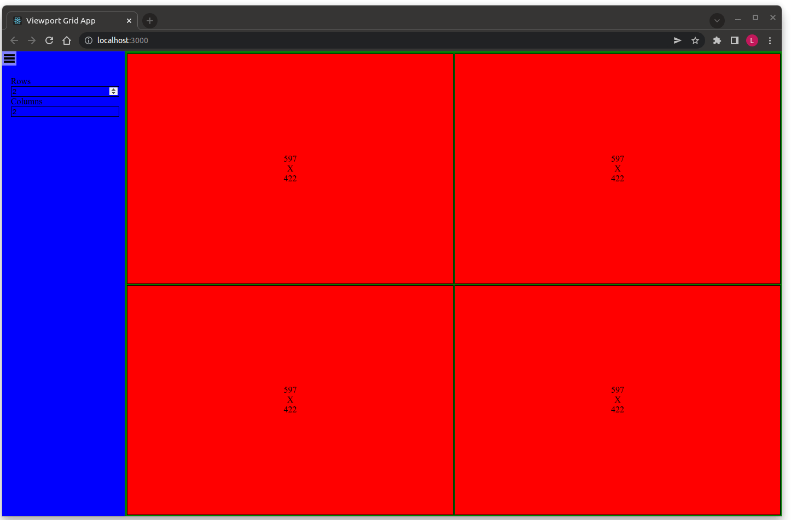

# Viewport Grid

## Task

Develop a single-page application featuring a consistent grid of viewports, accompanied by a static sidebar. This sidebar should offer "Rows" and "Columns" as input fields, each accepting values ranging from 1 to 10, alongside a toggle button for collapsing or expanding the sidebar. The grid should accurately display the specified number of "Rows" and "Columns," positioning a viewport in each grid cell. It's essential for the grid to occupy the available space, evenly distributing all viewports with a modest separation between them, and to dynamically adjust in response to changes in browser size or the state of the sidebar. Each viewport should be outlined with a slender border and constantly monitor its dimensions, displaying them centrally. While the provided color scheme is a guideline, the overall design should be fine-tuned for a sleek, contemporary user experience.

### Example

### Constraints

- Solution should be production quality, documented, and reusable.
- Solution should contain appropriate unit testing.
- Solution should not require additional NPM packages.
- Solution should work against the latest version of Chrome, Firefox and Edge

## Requirements

- nodejs >=14.19.1

## Running Development Mode

### `npm start`

Runs the app in the development mode.\
Open [http://localhost:3000](http://localhost:3000) to view it in the browser.\
The page will reload if you make edits.
